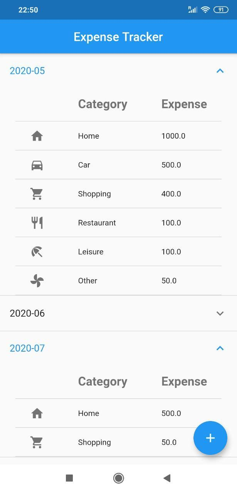

# Expense Tracker in Flutter

This is a simple yet useful "Expense Tracker" mobile application made using Flutter/Dart programming language.

You can enter your expenses in different categories ["Home", "Car", "Shopping", "Restaurant", "Leisure", "Other"] and the app will show your total expenses in each category in a monthly basis. 

Here is a screenshot from the app:

### Required Softwares

- Android Studio
- Flutter

