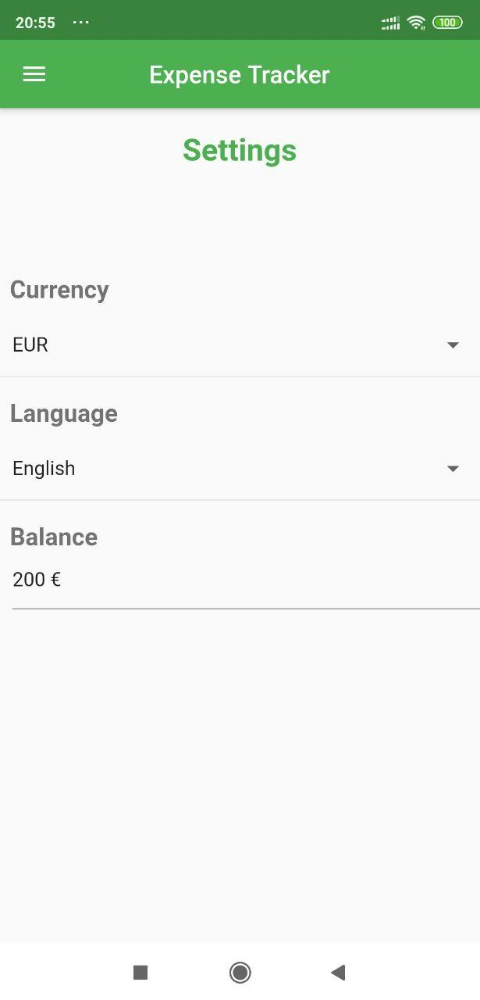

# Expense Tracker in Flutter

Mobile application to track your daily expenses. Implemented using Dart programming language and Flutter framework.

You can enter your income or expenses in different categories ["Home", "Car", "Shopping", "Restaurant", "Leisure", "Other"] and the app will show your total expenses in each category on a monthly basis. 

Here are some screenshots from the app:

  
   
   
  

### Required Softwares

- Android Studio
- Flutter

